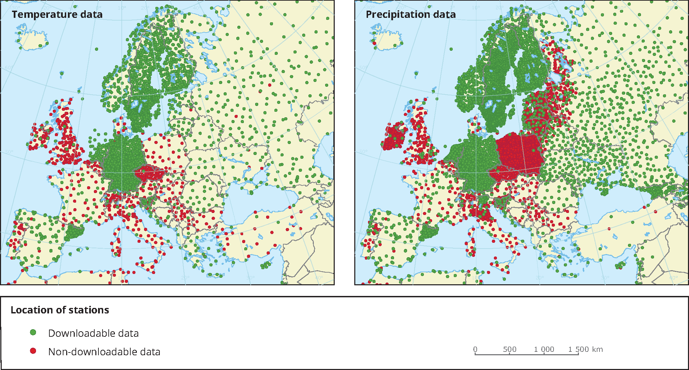

# Dynabench: A benchmark dataset for learning dynamical systems from low-resolution data

This is the repository containing the data generation algorithms as well as all baseline models for the __Dynabench: A benchmark dataset for learning dynamical systems from low-resolution data__ paper (accepted at ECML-PKDD 2023)

DynaBench is a benchmark dataset for learning dynamical systems from data. Dynamical systems are physical systems that are typically modelled by partial differential equations (e.g. numerical weather prediction, climate models, fluid simulation, electromagnetic field simulation etc.). The main challenge of learning to predict the evolution of these systems from data is the chaotic behaviour that these systems show (small deviation from the initial conditions leads to highly different predictions) as well as data availability. In real world settings only low-resolution data is available, with measurements sparsly scattered in the simulation domain (see following figure illustrating the distribution of weather monitoring stations in europe).




In this benchmark we try to simulate this setting using synthetic data for easier evaluation and training of different machine learning models. To this end we generated simulation data by solving five different PDE systems which were then postprocessed to create low-resolution snapshots of the simulation.

There main tasks for which the dataset has been generated is forecasting - predicting the next state(s) of the system

The six included different equations were selected to be both sufficiently complex, as well as sufficiently variable to simulate different physical systems (first and second order, coupled equations, stationary and non-statinary).

An example (wave equation) of a simulated system is shown below:


## Equations
There are four different equations in the dataset, each with different characteristics summarized in the following table:

| Equation             | Components | Time Order | Spatial Order |
|----------------------|------------|------------|---------------|
| Advection            | 1          | 1          | 1             |
| Burgers'             | 2          | 1          | 2             |
| Gas Dynamics         | 4          | 1          | 2             |
| Kuramoto-Sivashinsky | 1          | 1          | 4             |
| Reaction-Diffusion   | 2          | 1          | 2             |
| Wave                 | 1          | 2          | 2             |

## Setup
### Automated setup
If needed create a virtual environment and activate it
You can then install all dependencies by running 

    sh scripts/install_requirements.sh

from the main project directory

### Manual installation
Alternatively you can manually install the dependencies from the `requirements.txt` file:

    pip install -r requirements.txt

It is recommended to first create a virtual environment, for example:

    python -m venv venv
    source venv/bin/activate

Additionally you need to install pytorch geometric, following the instructions on [their website](https://pytorch-geometric.readthedocs.io/en/latest/notes/installation.html).


## Generation
To generate the data for a specific equation run

    python generate.py num_simulations=NUM_SIMULATIONS equation=EQUATION split=DATASET_SPLIT

Where `NUM_SIMULATIONS` indicates how many times each equation is simulated,`EQUATION` is one of (advection, burgers, gas_dynamics, kuramoto_sivashinsky, reaction_diffusion, wave), and `DATASET_SPLIT` is one of train, test, val

The full benchmark dataset contains 7000 simulations for the training set, 1000 for the validation set and 1000 for the test set, all divided into chunks of 500 simulations.

Warning: this can take a long time.

## Data format
The data is stored in *.tar* archives in chunks of 500 simulations. Each simulation consists of one file called XXXXXXX.data containing the simulation values for the given setting (cloud/grid + number of points) as well as a file called XXXXXXX.data containing the coordinates of the points at which the measurements were recorded.

## Usage
To reproduce the experiments from our paper run:
    python main.py equation=EQUATION model=MODEL support=cloud num_points=NUM_POINTS

This will start the training for a specific setting. The parameters specify which model, task, support structure, number of points etc. should be run. The available choices of parameters are:

    EQUATION = [brusselator, gas_dynamics, kuramoto_sivashinsky, wave, advection]

    MODEL = [persistence, point_gnn, point_net, point_transformer, gat, gcn, feast, kernelNN, graphpde]


To run the experiments for the grid models run:
    python main.py equation=EQUATION model=MODEL support=grid num_points=NUM_POINTS datamodule=torch" lightningmodule=gridmodule support=grid

with `MODEL` selected from [neuralpde, resnet, cnn]

Additionally, to use the benchmark for your own research use the included datasets.The repository contains two dataset classes to handle the generated data.

1. A pytorch dataset class, where each sample has the form $X\in\mathbb{R}^{L\times N\times D}$, where L is the lookback, N is the number of points and D is the number of target variables. See documentation of the dataset for details. To initialize the dataset class:

```python
DynaBenchBase(
    mode: str = 'train',
    equation: str = 'gas_dynamics',
    task: str = 'forecast',
    support: str = 'grid',
    num_points: str = 'high',
    base_path: str = 'data',
    lookback: int = 1,
    rollout: int = 1,
    test_ratio: float = 0.1,
    val_ratio: float = 0.1,
    merge_lookback: bool = True,
    *args,
    **kwargs
)
```

Initializes a pytorch dataset with selected parameters. The data is loaded lazily. 


**Args:**

- <b>`mode`</b> (str, optional):  the selection of data to use (train/val/test). Defaults to "train". 
- <b>`equation`</b> (str, optional):  the equation to use. Defaults to "gas_dynamics". 
- <b>`task`</b> (str, optional):  Which task to use as targets. Defaults to "forecast". 
- <b>`support`</b> (str, optional):  Structure of the points at which the measurements are recorded. Defaults to "grid". 
- <b>`num_points`</b> (str, optional):  Number of points at which measurements are available. Defaults to "high". 
- <b>`base_path`</b> (str, optional):  location where the data is stored. Defaults to "data". 
- <b>`lookback`</b> (int, optional):  How many past states are used to make the prediction. The additional states can be concatenated along the channel dimension if merge_lookback is set to True. Defaults to 1. 
- <b>`rollout`</b> (int, optional):  How many steps should be predicted in a closed loop setting. Only used for forecast task. Defaults to 1. 
- <b>`test_ratio`</b> (float, optional):  What fraction of simulations to set aside for testing. Defaults to 0.1. 
- <b>`val_ratio`</b> (float, optional):  What fraction of simulations to set aside for validation. Defaults to 0.1. 
- <b>`merge_lookback`</b> (bool, optional):  Whether to merge the additional lookback information into the channel dimension. Defaults to True. 


2. A graph dataset, specifically used for Message Passing Neural Networks implemented using the [Pytorch Geometric](https://pytorch-geometric.readthedocs.io/) module. It has a similar structure as the base DynaBench dataset.


## Benchmark Results
The following tables show the results of our experiments

- forecast task, 900 points (1-step MSE):

| model             |   Advection |    Burgers |   Gas Dynamics |   Kuramoto-Sivashinsky |   Reaction-Diffusion |       Wave |
|:------------------|------------:|-----------:|---------------:|-----------------------:|---------------------:|-----------:|
| CNN               | 5.30848e-05 | 0.0110988  |     0.00420368 |            0.000669837 |          0.00036918  | 0.00143387 |
| FeaSt             | 0.000130351 | 0.0116155  |     0.0162     |            0.0117867   |          0.000488848 | 0.00523298 |
| GAT               | 0.00960113  | 0.0439986  |     0.037483   |            0.0667057   |          0.00915208  | 0.0151498  |
| GCN               | 0.026397    | 0.13899    |     0.0842611  |            0.436563    |          0.164678    | 0.0382004  |
| GraphPDE          | 0.000137098 | 0.0107391  |     0.0194755  |            0.00719822  |          0.000142114 | 0.00207144 |
| KernelNN          | 6.31157e-05 | 0.0106146  |     0.013354   |            0.00668698  |          0.000187019 | 0.00542925 |
| NeuralPDE         | 8.24453e-07 | 0.0112373  |     0.00373416 |            0.000536958 |          0.000303176 | 0.00169871 |
| Persistence       | 0.0812081   | 0.0367688  |     0.186985   |            0.142243    |          0.147124    | 0.113805   |
| Point Transformer | 4.41633e-05 | 0.0103098  |     0.00724899 |            0.00489711  |          0.000141248 | 0.00238447 |
| PointGNN          | 2.82496e-05 | 0.00882528 |     0.00901649 |            0.00673036  |          0.000136059 | 0.00138772 |
| ResNet            | 2.15721e-06 | 0.0148052  |     0.00321235 |            0.000490104 |          0.000156752 | 0.00145884 |

- forecast task, 900 points (16-step rollout MSE):

| model             |       Advection |   Burgers |   Gas Dynamics |   Kuramoto-Sivashinsky |   Reaction-Diffusion |     Wave |
|:------------------|----------------:|----------:|---------------:|-----------------------:|---------------------:|---------:|
| CNN               |     0.00161331  |  0.554554 |       0.995382 |            1.26011     |          0.0183483   | 0.561433 |
| FeaSt             |     1.48288     |  0.561197 |       0.819594 |            3.74448     |          0.130149    | 1.61066  |
| GAT               | 41364.1         |  0.833353 |       1.21436  |            5.68925     |          3.85506     | 2.38418  |
| GCN               |     3.51453e+13 | 13.0876   |       7.20633  |            1.70612e+24 |          1.75955e+07 | 7.89253  |
| GraphPDE          |     1.07953     |  0.729879 |       0.969208 |            2.1044      |          0.0800235   | 1.02586  |
| KernelNN          |     0.897431    |  0.72716  |       0.854015 |            2.00334     |          0.0635278   | 1.57885  |
| NeuralPDE         |     0.000270308 |  0.659789 |       0.443498 |            1.05564     |          0.0224155   | 0.247704 |
| Persistence       |     2.39393     |  0.679261 |       1.457    |            1.89752     |          0.275678    | 2.61281  |
| Point Transformer |     0.617025    |  0.503865 |       0.642879 |            2.09746     |          0.0564399   | 1.27343  |
| PointGNN          |     0.660665    |  1.04342  |       0.759257 |            2.82063     |          0.0582293   | 1.30743  |
| ResNet            |     8.64621e-05 |  1.86352  |       0.480284 |            1.0697      |          0.00704612  | 0.299457 |

## License

The content of this project itself, including the data and pretrained models, is licensed under the [Creative Commons Attribution-ShareAlike 4.0 International Public License (CC BY-SA 4.0)](https://creativecommons.org/licenses/by-sa/4.0/). The underlying source code used to generate the data and train the models is licensed under the [MIT license](LICENSE).