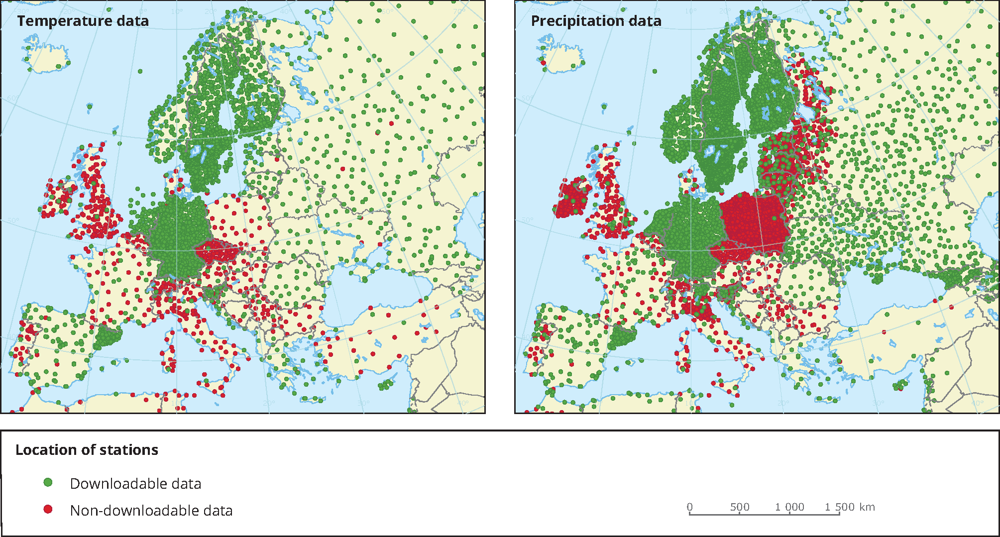

================
About DynaBench
================

DynaBench is a benchmark dataset for learning various tasks (such as forecasting and equation discovery) on dynamical systems from data. 
Dynamical systems are physical systems that are typically modelled by partial differential equations (e.g. numerical weather prediction, climate models, fluid simulation, electromagnetic field simulation etc.). 

----------------------
Why Another Benchmark?
----------------------

The main challenges of working with these systems are the chaotic behaviour that these systems show (small deviation from the initial conditions leads to highly different predictions) as well as data availability. 
In real world settings only low-resolution data is available, with measurements sparsly scattered in the simulation domain (see following figure illustrating the distribution of weather monitoring stations in europe).

-----------------    
What is included?
-----------------

In this benchmark we try to simulate this setting using synthetic data for easier evaluation and training of different machine learning models. 
To this end we generated simulation data by solving six different PDE systems which were then postprocessed to create low-resolution snapshots of the simulation.
Additional equations with different parameters can be generated by the user using the provided code.

The six included different equations were selected to be both sufficiently complex, as well as sufficiently variable to simulate different physical systems (first and second order, coupled equations, stationary and non-statinary).

An example (wave equation) of a simulated system is shown below:

.. image:: _images/wave_equation.gif

----------------
Equations
----------------

There are six different equations included in the original dataset. These can be downloaded using the provided API. Additionally, more equations can be generated using the provided code,
including completely new equations as well as variations of the existing ones.

The equations included in the original dataset are:

+----------------------+------------+------------+---------------+
| Equation             | Components | Time Order | Spatial Order |
+======================+============+============+===============+
| Advection            | 1          | 1          | 1             |
+----------------------+------------+------------+---------------+
| Burgers'             | 2          | 1          | 2             |
+----------------------+------------+------------+---------------+
| Gas Dynamics         | 4          | 1          | 2             |
+----------------------+------------+------------+---------------+
| Kuramoto-Sivashinsky | 1          | 1          | 4             |
+----------------------+------------+------------+---------------+
| Reaction-Diffusion   | 2          | 1          | 2             |
+----------------------+------------+------------+---------------+
| Wave                 | 1          | 2          | 2             |
+----------------------+------------+------------+---------------+